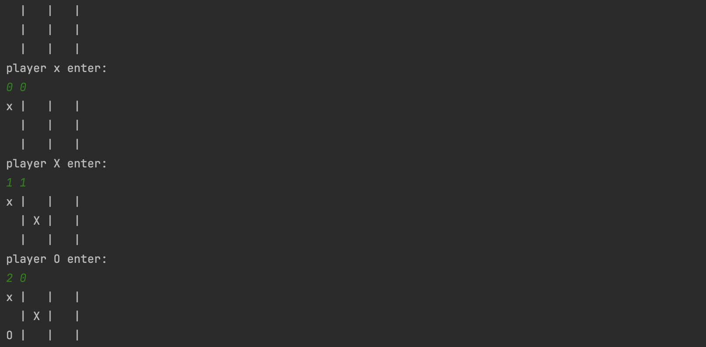

# 🎮 Java Tic Tac Toe Game


A fun and simple command-line Tic Tac Toe game for two players, written in Java. Perfect for learning the basics of Java programming!

## ✨ Features
- 🎲 **Two-player mode**: Play against a friend on the same device.
- 💡 **Win Detection**: Recognizes a winning row, column, or diagonal.
- 🛡️ **Input Validation**: Ensures moves are made on valid, empty cells.
- 📋 **Display Board**: Updates the board after each move.

## 📑 Table of Contents
- [Getting Started](#-getting-started)
- [How to Play](#-how-to-play)
- [Example Gameplay](#-example-gameplay)
- [Code Explanation](#-code-explanation)
- [Contributing](#-contributing)
- [License](#-license)

## 🚀 Getting Started

### Prerequisites
Make sure you have Java installed on your computer (version 8 or higher). 

### Installation
1. **Clone the Repository**:
   ```bash
   git clone https://github.com/your-username/Java-TicTacToe.git
   cd Java-TicTacToe
   ```

	2.	Compile and Run:

  ```bash  
  javac Main.java
  java Main
  ```

## 🎮 How to Play
1. Run the program. 
2. Players take turns entering row and column numbers (0, 1, or 2) to place their symbol (X or O) on the board.
3. The first player to align three symbols in a row, column, or diagonal wins! 
4. If the board is full with no winner, the game ends in a draw.

## 📋 Example Gameplay

[](https://github.com/Nipuna-Lakruwan/Java-TicTacToe)

## 🧩 Code Explanation

| Method           | Description                                                    |
|------------------|----------------------------------------------------------------|
| `printBoard`     | Displays the board after each move.                            |
| `haveWon`        | Checks for a win condition by row, column, or diagonal.        |
| `main`           | Manages the game flow, alternating turns, and checking moves.  |

## 🤝 Contributing
Contributions are welcome! Feel free to fork this repository and submit a pull request to enhance or add new features.

1. **Fork the Project**
2. **Create a Feature Branch** (`git checkout -b feature/YourFeature`)
3. **Commit Your Changes** (`git commit -m 'Add Some Feature'`)
4. **Push to the Branch** (`git push origin feature/YourFeature`)
5. **Open a Pull Request**

## 📜 License
This project is open source and available under the [MIT License](LICENSE).

💻 Happy Coding!
